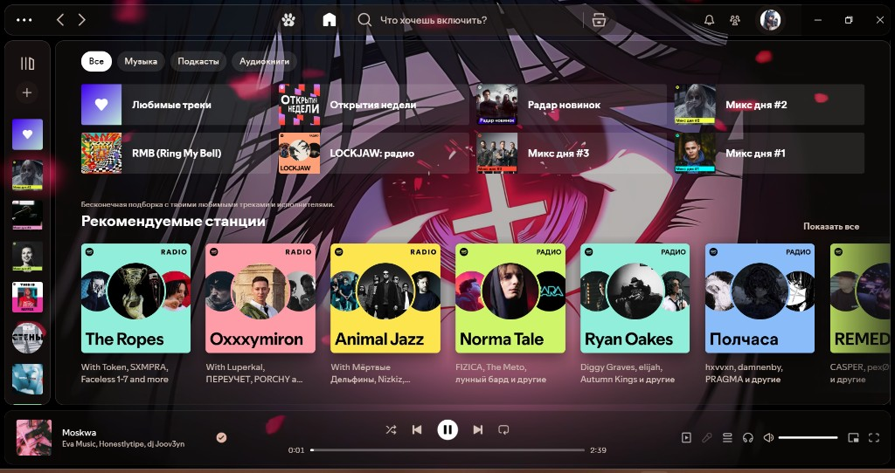
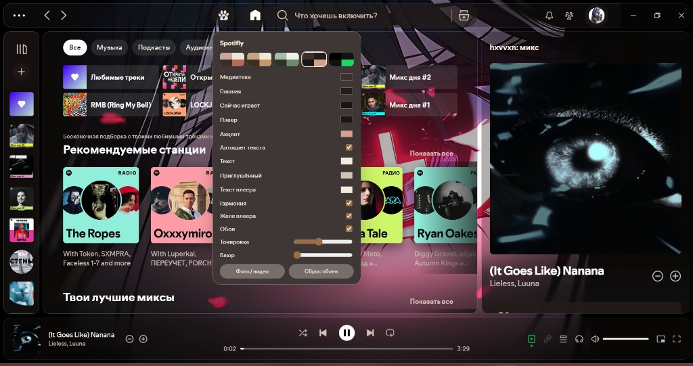

# Spotifly

Кастомный десктоп-клиент для Windows: стеклянный интерфейс поверх Spotify Desktop.

Не связан со Spotify AB.

## Скачать

Установщик: [`Spotifly-Setup.exe` в Telegram](https://t.me/+Ci309FiAk1BjYmMy)

Ставится в `Program Files\Spotifly`, ярлык и удаление — как у обычной программы. Нужны Windows 10/11 64-bit и права администратора.

## На чём сделано

| | |
| --- | --- |
| База | Официальный **Spotify Desktop для Windows** (CEF), сборка **1.2.84.465** |
| Патчи | Слой в духе **SpotX**: без рекламы, часть ограничений free-аккаунта снята |
| Тема | Свой слой **Spotifly**: стекло, обои, кастомизатор (кнопка с лапкой) |
| ОС | Windows 10 / 11, **64-bit** |
| Вход | Свой аккаунт Spotify, интернет |

Это не отдельный стриминг и не «свой Spotify». Каталог, логин и серверы — Spotify.

## Тема

- Обои: фото, GIF, беззвучные MP4/WebM
- MP4/WebM автоматически ставятся на паузу, когда окно свернуто
- Галерея локальных обоев Wallpaper Engine прямо в кастомизаторе
- Только реально установленные Video- и Web-проекты; нескачанные карточки не показываются
- Web-визуализаторы получают аудиоспектр Windows и реагируют на музыку
- MP4 один раз конвертируются в кэшированный VP9/WebM, после чего не требуют захвата экрана
- Заполнение, масштаб, горизонтальное и вертикальное позиционирование обоев
- Регулируемое качество WEB-обоев с безопасным ограничением нагрузки
- Тонировка и блюр панелей
- Цвета медиатеки, главной, «сейчас играет», плеера, акцента
- Пресеты и гармония палитры
- Автоцвет текста
- Желе плеера на скипе
- Кнопка кастомизации слева от Home

### Wallpaper Engine

Spotifly сам находит библиотеки Steam и проекты из `steamapps\workshop\content\431960`. Ничего копировать вручную не нужно: лапка → **Выбрать из Wallpaper Engine**.

- `video` при первом выборе подготавливаются в фоне, показывают прогресс и позволяют отменить операцию; затем запускаются как обычное зацикленное беззвучное WebM-видео;
- `web` запускаются в изолированном слое, а API `wallpaperRegisterAudioListener` получает 64 частотные полосы на каждый канал;
- любой собственный звук обоев принудительно глушится;
- при сворачивании окна видео, WebAudio и анализ звука останавливаются;
- `scene` и `application` намеренно не показываются: их нельзя встроить без запуска Wallpaper Engine и дорогого захвата окна;
- Wallpaper Engine не запускается в фоне, а Spotifly не создаёт скрытых окон и не гонит MJPEG-поток;
- неустановленные и удалённые проекты не попадают в галерею.

Для импорта нужен установленный проект в библиотеке Steam. Сам Wallpaper Engine и Steam во время воспроизведения запускать не требуется. Spotifly не скачивает и не распространяет чужие проекты.

Аудиореакция сейчас анализирует общий выход Windows. Если одновременно играет другое приложение, визуализатор может реагировать и на него.

## Реклама и «премка»

В этой сборке уже стоят клиентские патчи (не официальная подписка Spotify Premium):

**Есть в клиенте**

- Без аудио- и баннерной рекламы
- Скипы без лимита free
- Тексты песен
- Без постоянных экранов «оформи Premium»

**Это не замена оплаченному Premium**

- Офлайн-загрузки и часть серверных фич могут вести себя как на free
- Spotify может в любой момент поменять API — сборка не вечная
- Нужен обычный аккаунт, пиратить каталог клиент не умеет

## Установка

1. Скачать [`Spotifly-Setup.exe`](https://t.me/+Ci309FiAk1BjYmMy)
2. Закрыть официальный Spotify, если запущен
3. Запустить установщик (нужны права администратора)
4. Войти в свой аккаунт

Запускайте приложение через ярлык **Spotifly**: он включает Wallpaper Host и затем открывает клиент. Дополнительный .NET или отдельная настройка не нужны.

Можно держать рядом с обычным Spotify: ярлык другой, папка `Program Files\Spotifly`. Кэш логина у Windows-клиента общий — это нормально для такой базы.

SmartScreen может ругнуться: файл не подписан. Подробнее → выполнить.

## Файлы темы в репо

- `_xpui/unpacked/spotifly/` — CSS, JS, лапка, обои.
- `wallpaper-host/` — локальный сервер установленных Workshop-проектов, видеокэш и аудиоспектр.
- `_installer/` — сценарий установщика Inno Setup.

Сам клиент Spotify и его бинарные файлы в репозиторий не выкладываются.

Для локальной сборки установщика нужен FFmpeg: положите `ffmpeg.exe` в `_tools/ffmpeg.exe`. Бинарник не хранится в Git; лицензия и ссылка на исходники указаны в `THIRD-PARTY-NOTICES.txt`.
